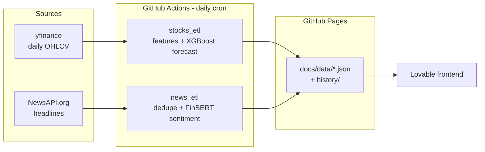

# StockSentinel

**Sentiment-driven stock monitoring — a fully automated, zero-cost data pipeline.**

Every day, GitHub Actions fetches market prices and financial news for **AMZN, GOOGL and MSFT**, scores each headline with **FinBERT** (a finance-tuned BERT model), trains an **XGBoost** model to forecast the next day's close, and publishes everything as static JSON on **GitHub Pages** — consumed live by the [frontend](https://sentiment-driven-investment.lovable.app/).

> ⚠️ **Academic project.** Predictions are for demonstration only and are not investment advice.

[](https://github.com/Pipe199x/StockSentinel/actions/workflows/etl-stocks-cron.yml)
[](https://github.com/Pipe199x/StockSentinel/actions/workflows/etl-news-cron.yml)

## Architecture



- **`stocks_etl/`** — downloads daily OHLCV since 2020 (NYSE calendar), builds technical features (returns, SMA, RSI, rolling volatility) and trains an XGBoost regressor per ticker to predict the next-day close. Runs at 22:30 UTC, after market close.
- **`news_etl/`** — fetches the last 2 days of headlines per ticker, merges them with the accumulated history, applies a per-ticker daily cap, and scores new articles with [ProsusAI/finbert](https://huggingface.co/ProsusAI/finbert) on CPU. Runs at 12:15 UTC.
- **`docs/`** — the published dataset, served by GitHub Pages. Daily data commits also keep the scheduled workflows active.
- **`api/`** — an optional FastAPI serving layer over the same data, runnable locally.

## Live data endpoints

| Endpoint | Content |
|---|---|
| [`manifest.json`](https://pipe199x.github.io/StockSentinel/data/manifest.json) | Last-updated timestamps per pipeline |
| [`prices_latest.json`](https://pipe199x.github.io/StockSentinel/data/prices_latest.json) | Last 30 days of prices per ticker |
| [`predictions_latest.json`](https://pipe199x.github.io/StockSentinel/data/predictions_latest.json) | Next-day close forecast per ticker |
| [`news_latest.json`](https://pipe199x.github.io/StockSentinel/data/news_latest.json) | Recent news with FinBERT sentiment |
| [`history/`](https://pipe199x.github.io/StockSentinel/data/history/prices_history.csv) | Full price history, accumulated news and prediction track record |

## Running locally

```bash
pip install -r stocks_etl/requirements.txt
python -m stocks_etl.stocks_etl --config stocks_etl/config.yaml

# News (needs a free NewsAPI key; FinBERT downloads ~440MB on first run)
cp .env.example .env   # set NEWSAPI_KEY
pip install torch --index-url https://download.pytorch.org/whl/cpu
pip install -r news_etl/requirements.txt
python -m news_etl.news_client --out data/news_raw.ndjson --tickers AMZN,MSFT,GOOGL --days 2
python -m news_etl.news_etl --config news_etl/config.yaml
```

Optional local API:

```bash
pip install -r api/requirements.txt
uvicorn api.app.main:app --reload
# GET /v1/stocks, /v1/news, /v1/predictions, /v1/manifest
```

## Notes and limitations

- NewsAPI's free tier delays articles ~24h and caps at 100 requests/day; the incremental fetch uses ~12.
- The prediction quality metric (`mae_backtest_30d`) is an in-sample backtest — indicative, not rigorous out-of-sample validation.
- Entire stack runs on free tiers: GitHub Actions, GitHub Pages, NewsAPI free plan, Hugging Face model hosting.
